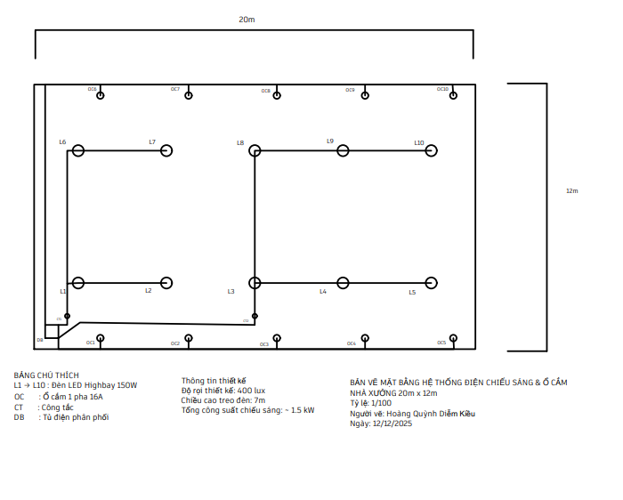
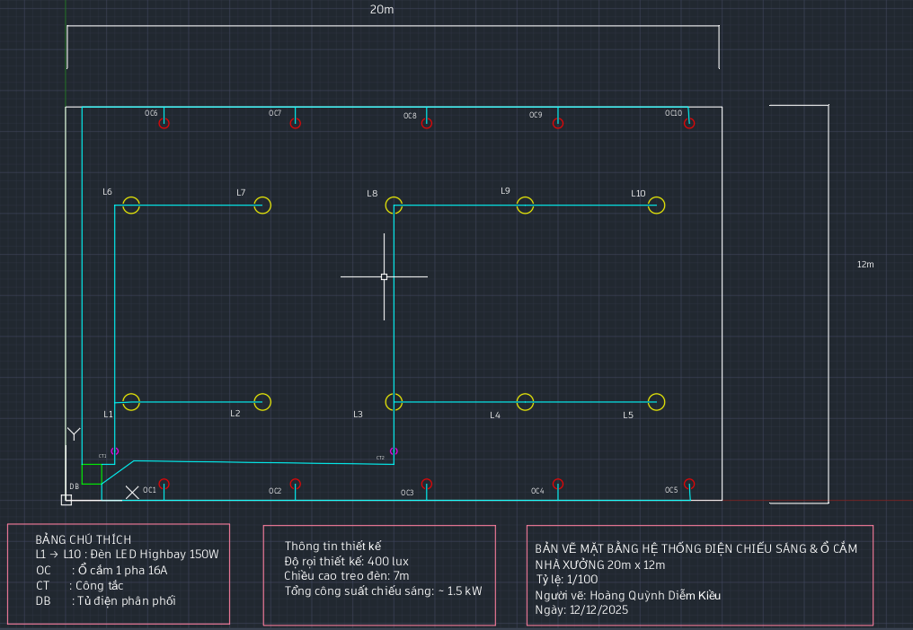

# Hệ thống đèn và ổ cắm nhà xưởng

## Giới thiệu

Đây là dự án thiết kế bản vẽ hệ thống đèn và ổ cắm cho nhà xưởng bằng AutoCAD.

## Công cụ

- AutoCAD Web
- Git
- GitHub

## Nội dung

- Bản vẽ AutoCAD: thư mục DWG
- Bản xuất PDF: thư mục PDF
- Hình ảnh bản vẽ: thư mục Images

## Hình ảnh

